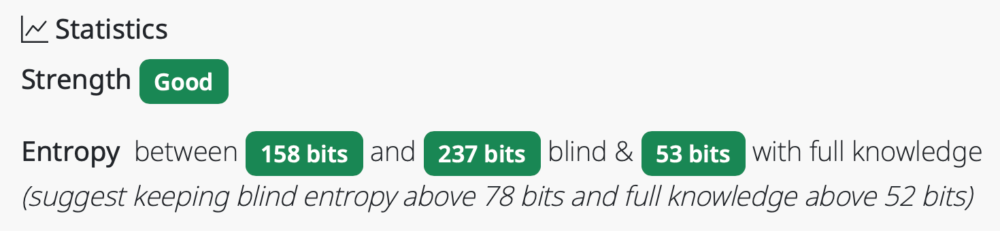

# Interpreting Statistics and Entropy

## How Strong are XKPasswd Passwords?

The answer is, "it depends." If you want to dig into the maths used to calculate password strength with XKPasswd, read the section of the user guides entitled [“🐉 Thar be Dragons!”](the-maths.md).

But if you just want to learn how to interpret the password strength information you'll see in XKPasswd, read on.

## High Entropy is Good, Low is Bad

For every preset or personalized settings in XKPasswd, you'll see some statistics at the bottom of the screen.  If you don't want to pay attention to any of the numbers, it's quite simple: green: good, yellow OK, red bad!

If you want to ensure your password is most unlikely to be crackable, make sure all of the boxes turn green. If you get a yellow, or a red, use the Settings options to increase the complexity or length of the password generation forumla.

But we can get a bit more nuanced in our understanding if we look at the numbers.  Each value you'll see is for the number of bits of entropy. The higher the number of bits, the harder the password formula is to crack.  

### Full Knowledge

If we start with the last number, it will say a number of bits with full knowledge.  Full knowledge means that the bad actor knows exactly what formula you used to create the passwords you're considering.

Even if the bad actor knows you have a formula to create a password with 4 words of 4-characters each and separated by dashes with two special characters on either end and two numbers, that password is still really hard to crack and will have a high number of bits of entropy.

### Blind

The first two numbers are a range of number of bits of entropy for what we called "blind". Unlike full knowledge, these numbers represent how hard a password generated with these settings would be when the bad actor knows nothing about the formula used to create them.

Blind entropy shows a range because some of the settings have ranges. For example, the DEFAULT formula has a range


_Example of all happy green buttons_

## Examples

Let’s take a closer look at some examples to explain the color coding (and the numbers.). If we start with the default settings and simply click the Generate button to get 3 passwords, we can see the Strength says Good in a green box, and all of the Entropy numbers are highlighted in green as well.

The Strength is marked green with Good in the box because all of the entropy numbers are good. 




example of poor - Temporary
all are red


example of still poor
 temporary but min length 4, max length 5
 poor because full knowledge and configuration of some blind are < 78 bits of entropy
 
 Example of OK
 temporary but 3 words of 4/4
 blind is 92 but full knowledge is 33
 
 DELETEME:
 ```js	
 	__passwordStrength(stats) {
    const minEntropyBlind = stats.minEntropyBlind.value;
    const entropySeen = stats.entropySeen.value;

    const entropyBlindThreshold = this.#entropyBlindThreshold;
    const entropySeenThreshold = this.#entropySeenThreshold;

    // mix of good and bad
    let passwordStrength = 'OK';

    if ((minEntropyBlind >= entropyBlindThreshold) &&
        (entropySeen >= entropySeenThreshold)) {
      // all good
      passwordStrength = 'GOOD';
    } else if ((minEntropyBlind < entropyBlindThreshold) &&
               (entropySeen < entropySeenThreshold)) {
      // all bad
      passwordStrength = 'POOR';
    }
    return passwordStrength;
  }
```