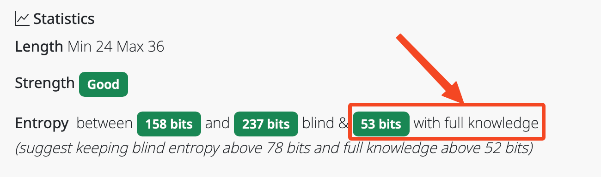
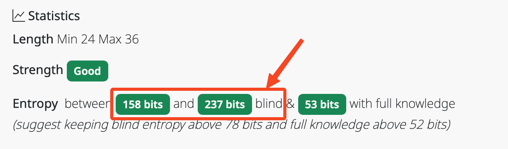
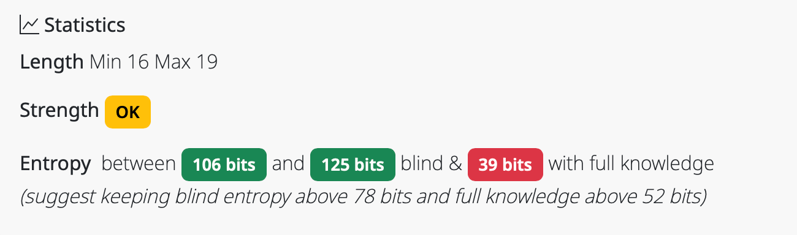
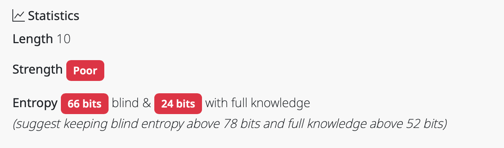

# Interpreting Strength and Entropy Statistics

## How Strong are XKPasswd Passwords?

The answer is, "it depends." If you want to dig into the maths used to calculate password strength with XKPasswd, read the section of the user guides entitled [“🐉 Thar be Dragons!”](the-maths.md).

But if you just want to learn how to interpret the password strength information you'll see in XKPasswd, read on.

## High Entropy is Good, Low is Bad

For every preset or personalized settings in XKPasswd, you'll see some statistics at the bottom of the screen.  If you don't want to pay attention to any of the numbers, it's quite simple: green: good, yellow OK, red bad!

_Example of all happy green buttons_

If you want to ensure your password is most unlikely to be crackable, make sure all of the boxes turn green. If you get a yellow, or a red, use the Settings options to increase the complexity or length of the password generation forumla.

But we can get a bit more nuanced in our understanding if we look at the numbers.  Each value you'll see is for the number of bits of entropy. The higher the number of bits, the harder the password formula is to crack.  

At the bottom of the statistics section you’ll see it says, “(suggest keeping blind entropy above 78 bits and full knowledge above 52 bits)” which we’ll explain as we go through each section.

### Full Knowledge

If we start with the last number, it will say a number of bits with full knowledge.  Full knowledge means that the bad actor knows exactly what formula you used to create the passwords you're considering.

Even if the bad actor knows you have a formula to create a password with 4 words of 4-characters each and separated by dashes with two special characters on either end and two numbers, that password is still really hard to crack and will have a high number of bits of entropy.

If the entropy of the given formula has an entropy above 52 bits with full knowledge, the little box will be green. As you can see in the screenshot below, full knowledge for the default password has an entropy of 53 bits, so it turns green.

_Full Knowledge Entropy_

### Blind

The first two numbers are a range of number of bits of entropy for what we called "blind". Unlike full knowledge, these numbers represent how hard a password generated with these settings would be when the bad actor knows nothing about the formula used to create them.

Blind entropy shows a range because some of the settings have ranges. For example, the DEFAULT formula uses 3 words with a range of 4 to 8 characters in length. Since XKPasswd creates these passwords using a dictionary of words (in this case from 4 to 8 characters) it’s possible that the 3 words generated could all be 4 characters long, or all 8 characters long, or any combination of the two.

In the screenshot below, you can see that blind entropy is between 158 bits and 237 bits for the default configuration, which is well above the threshold of 78 bits so the values are colored green.

_Blind Entropy Ranges_

### Strength

The final statistic is actually the first one you see: Strength.  Strength will show as Good in green if all of the entropy values are within their recommended ranges: blind above 78 bits and full knowledge above 52 bits. If any one of those values are below their recommended ranges, then Strength will say OK in yellow.

In the example below you can see that Full Knowledge has dropped below the 52-bit threshold, while Blind is still above 78 bits, so Strength says OK in yellow.

_Strength is only OK because Full Knowledge is below its threshold_

If all of the entropy numbers are below their threshold values, then Strength will drop to Poor and be colored red.  A good example of a poor strength password is the TEMPORARY preset. This password is only for extreme conditions where you have to temporarily set a very easy password. The warning says they are not secure and should be changed immediately. If you create a password using the TEMPORARY preset, you’ll see in the screenshot below that the Blind and Full Knowledge entropy values are below the thresholds and therefore the Strength is shown as poor.

_Strength is Poor because Blind and Full Knowledge are below their thresholds_

## Bottom Line

Whether you choose one of the presets or if you use the Settings section to tailor your own password, if you see all green when you’ve generated your passwords, you can be confident that you have terrific passwords from which to choose.